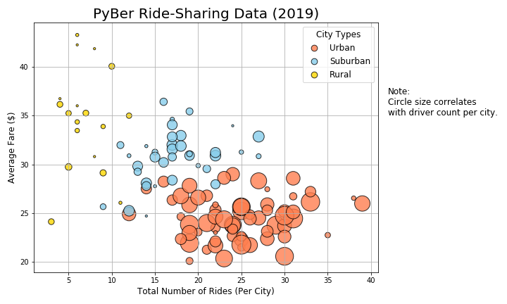
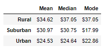

# PyBer_Analysis

## Project Overview 
Given the task to perform an exploratory analysis on PyBer, a Python-based Ride-Sharing app company. The analysis is based on City data and Ride data, where a variety of charts will be produced to showcase the relationship between type of City and the number of Drivers and Riders, in addition to the percentage of Total Fares, Riders, and Drivers by Type of City. The analysis and visualizations will be used to help PyBer improve access to ride-sharing services and determine affordability for underserved neighborhoods. 

## Resources 
- Data Source(s): city_data.csv, ride_data.csv
- Software: Conda 4.8.3, Python 3.7.7, Matplotlib 3.1.3

## Summary - Deliverables 
- Bubble chart that showcases the average fare versus the total number of rides with bubble size based on the total number of drivers for each city type, including urban, suburban, and rural.

- Determine the mean, median, and mode for the following:
  - The total number of rides for each city type.
  
  
  - The average fares for each city type.
  
  
  - The total number of drivers for each city type.
  

- Box-and-whisker plots that visualize each of the following to determine if there are any outliers:
  - The number of rides for each city type.
  

  
  - The fares for each city type.
  

  
  - The number of drivers for each city type.
  

- Pie charts that visualizes each of the following data for each city type:
  - The percent of total fares.
  

  
  - The percent of total rides.
  

  
  - The percent of total drivers.
  

## Challenge Overview 
Determine if there is a correlation between the average fare and the total rides for each city type for the individual scatter plots, and if there is any statistical significance between the different city types for each box-and-whisker-plot.

## Challenge Summary 

### Key-Metrics Summary: 

The summary table displays the following for each of the Rural, Suburban, and Urban City Types: Total Rides, Total Fares, Average Fare per Ride, and Average Fare per Driver. The Total Rides, Drivers, and Fares column data increases in correlation with the type of city. Based on the Total Rides data, Rural areas have a lower use of the Pyber service with 125 Rides, versus Urban areas which utilize PyBer much more with 1,625 Rides. The higher Total Rides within each City Type, the more Drivers are available, and the higher Total Fares amount that is made from those rides. 

However, the Average Fares per Ride and per Driver display decrease between the City Types. This could be due to the demand or scarcity of drivers due to the City Type. Rural type areas have a higher Ride count than the total Drivers available, 125 Rides to 78 Drivers, and the Average Fare per Ride and Driver would be higher in order to meet the demand for rides and allow the Drivers to make a high profit in their Fares. Within Urban type areas, there were 1,625 Rides to 2,405 Drivers. Since there are more available Drivers than Rides, the Average Fare per Ride is reduced to $24.53, and Average Fare per Driver is $16.57. Suburban type areas have more of a balance between their Total Rides and Total Drivers, in which the demand is met where the Average Fare per Ride is $30.97 and Average Fare per Driver is $39.50 and allows some profit for the Driver. 

### Average Fare for Each Week by Each City Type - Graph Summary: 

The average weekly fare varies for each City Type per displayed graph. Between the weeks of January to February, there is a somewhat consistent rise in Fares. Urban and Rural fares display increases and decreases opposite of each other, while Suburban fares rise and fall slightly in a consistent arc. 

In the weeks between February and March, all three City Types display the same trend of rising and falling fares at the end of February. It can be assumed that a lot of traveling is occurring from the holidays within the middle and end of the month of February. 

From March to April, the average fares display different trends between City Types. The most noticeable is the rising and falling pattern in Urban fares from week to week, while Suburban and Rural types have less changes in their fares. 

For the beginning of April, both Urban and Rural types see an increase in fares, but the following weeks lead to a varied decline for both types. The opposite occurs for Suburban fares in the following weeks of April, where there is a steady increase in fares starting at the second week of the month, which could be from Spring Breaks from schools.  
